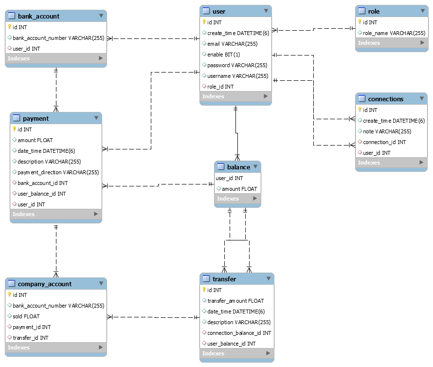

## Readme

# PayMyBuddy
## Qu'est ce que c'est?
**PayMyBuddy** est une appli qui permettrait aux clients de transférer de l'argent pour gérer leurs finances ou payer leurs amis.

 ## Lien
 https://github.com/ErikM06/OC_P6_PayMyBuddy.git
 
## Files

<<<<<<< HEAD

 ## Lien
 https://github.com/ErikM06/OC_P6_PayMyBuddy.git
 
## Files

![diagrams] (diagrams/P6_DBB_Modele/P6_DBB_Modele.png)
![class_diagram] (diagrams/domaine metierP6.png)
=======

>>>>>>> ccfee44 (new readme)

> Written with [StackEdit](https://stackedit.io/).
